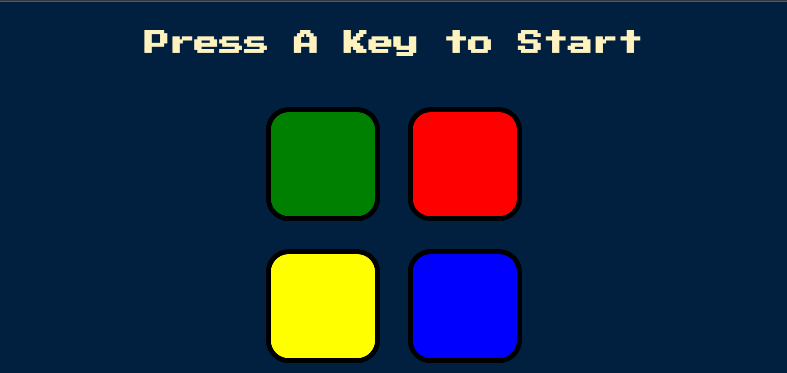

#  The Simon Game


## Table of contents

- [Overview](#overview)
  - [About Simon Game](#about-simon-game)
  - [Screenshot](#screenshot)
  - [Links](#links)
- [My process](#my-process)
  - [Built with](#built-with)
  - [What I learned](#what-i-learned)
  - [Continued development](#continued-development)
  - [Useful resources](#useful-resources)
- [Author](#author)
- [Acknowledgments](#acknowledgments)


## Overview

### About Simon Game

The Simon Game creates a series of tones and lights and requires a user to repeat the sequence. If the user succeeds, the series becomes progressively longer and more complex. Once the user fails the game is over. And to restart the game you can press any kye on your keyboard. 


### Screenshot




### Links


- Live Site URL: [Github Pages](https://saurabh13042004.github.io/The-Simon-Game/)

## My process

### Built with

- HTML5
- Vanilla Javascript
- jQuery
- CSS


### What I learned

I learned jQuery  and Javascript DOM maniulation while making this mini project. It game me hands-on practice on the Javascrtipt Concepts like objects and thier methods , function callback and etc.


Some code snippet for fun 😀:

```html
<h1>Come on , Let play Simon Game</h1>
```
```css
.completed-level-100 {
  color: yellow;
}
```
```js
const gameover = () => {
  console.log('😢')
}
```


### Continued development

I want to learn more about jQuery , and DOM manipulation  and will surely implement them in new projects.


## Author

- Github Profile Link - [Saurabh13042004](https://github.com/Saurabh13042004)
- Linkdin - [@saurabh-shukla](https://www.linkedin.com/in/saurabh-shukla-0b45b3224/)
- Instagram - [@saurabh._shukla._](https://www.instragram.com/saurabh._shukla._ )


## Acknowledgments


I would liked to thank Dr. Angela Yu for her guidance and support in web development bootcamp. Because of her I was able to learn the web development.

Thanks for reading this far, if you have any suggestions or feedback, please let me know in the comments below. I would love to hear from you.
